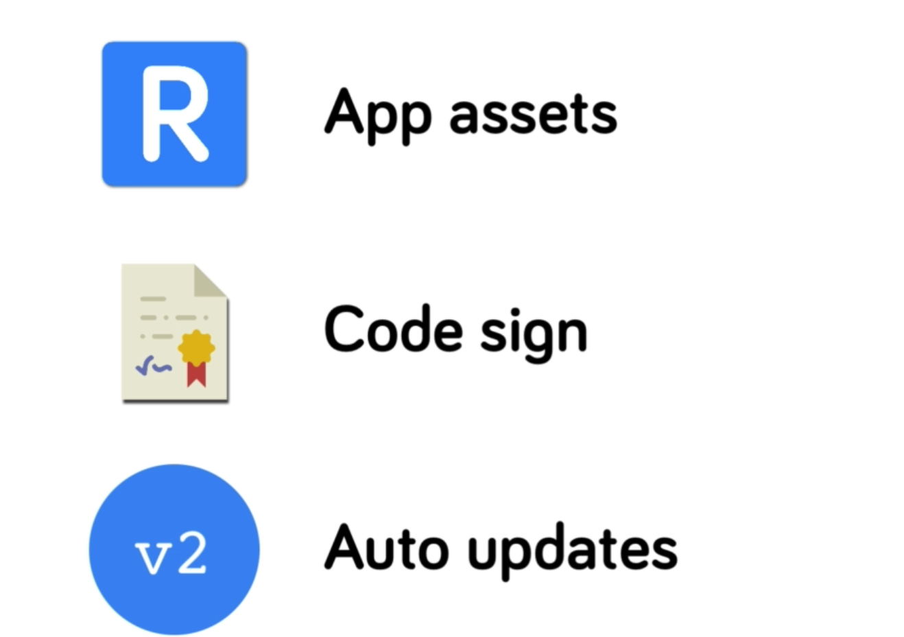
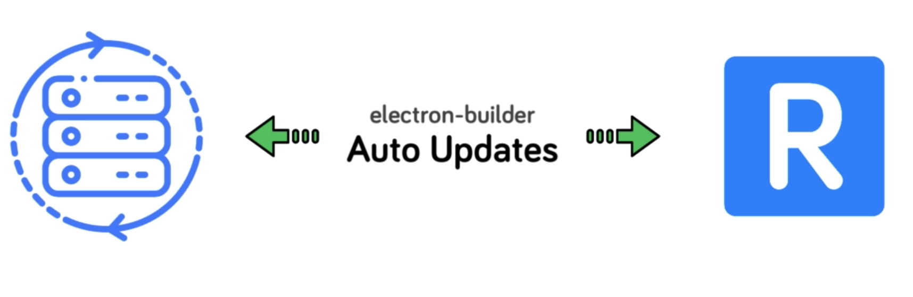
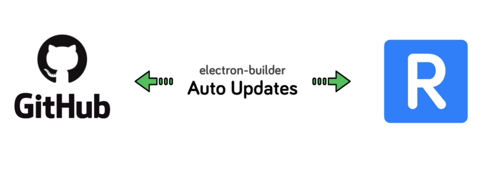

# 项目打包部署

### 1、基本概念

本节我们将介绍打包和分发我们的项目，内容包括代码签名和添加发布自动应用程序更新的功能。



为此，我们将使用electron builder模块。electron Builder 已成为打包 electron 几乎所有我们需要的所有功能，包括一个非常简单的使用 `electron` 更新。


我们应该听说将应用程序更新推送到官方的服务器。这里 `Mac` 应用程序商店需要一个专用的应用程序更新服务器。在配置和维护时，这通常增加了复杂性。

所以在使用electron Builder时，我们将看到如何实现将本地的应用



发布到 `Github` 服务器上，只使用 `Github` 更新服务器。



### 2、Eletron-Builder

```
npm install -g electron-builder
electron-builder -m zip
```
